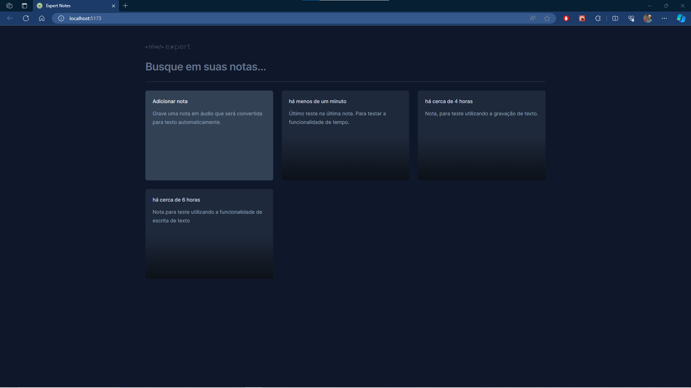
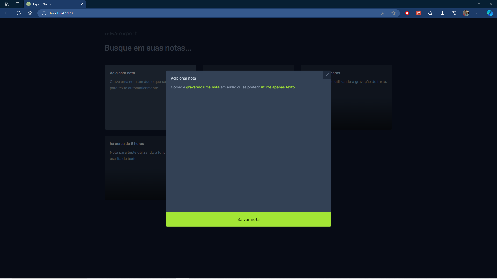
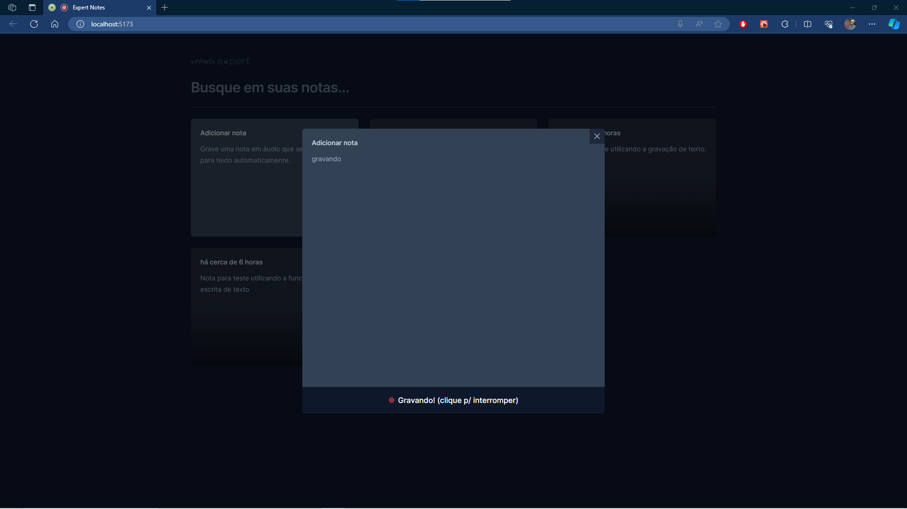

<h1 align="center"> Pizza Shop </h1>

🔨 Tools: Typescript, React.js, Vite, Tailwind, Radix-ui
#

# Get started

 To use the project, after downloading it you must run install all the dependencies. To do that, run the following command:

```
npm install
```

<br/>

To see the project running, you can run the following command:

```
npm run dev
```
<br/>

After that, you should be able to access the application in the address: 
<br>
[http://localhost:5173/](http://localhost:5173/)


# Pages preview

## Notes page
<p align="center">
  
</p>

## Add note page
<p align="center">
  
</p>

## Record note page
<p align="center">
  
</p>

